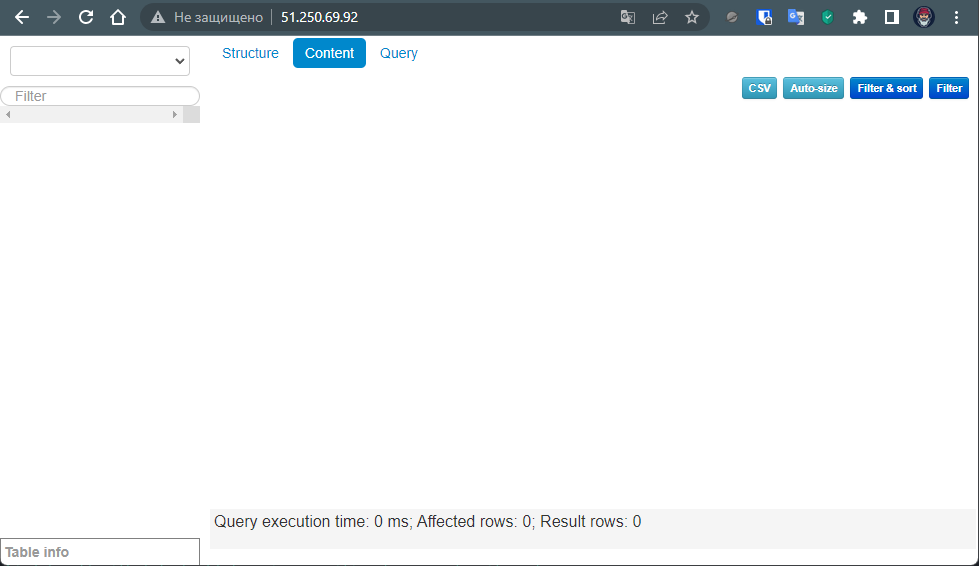

## Установка clickhouse, vector, lighthouse в Yandex.Cloud

Данный playbook создает три виртуальные машины в YC и автоматически устанавливает на них clichouse (node01.netology.cloud), vector (node02.netology.cloud), lighthouse (node03.netology.cloud)

#### Детальное описание:

На node01.netology.cloud бует установлено 3 пакета:
  - clickhouse-client
  - clickhouse-server
  - clickhouse-common-static  

Служба clickhouse-server будет запущена  

---
На node02.netology.cloud будет установлен пакет `vector`, служба будет запущена

---
На node03.netology.cloud булет установлено:
- git
- apache
- lighthouse

Служба apache будет запущена

---
#### Подготовка:  
Предварительно необходимо добавить в env $YC_TOKEN командой:
```bash
export YC_TOKEN=`yc iam create-token`
```
Ваш публичный ssh ключ должен находиться в дефолтной директории: `~/.ssh/id_rsa.pub`   

В файле `./src/terraform/variables.tf` необходимо указать Ваши id в `yandex_cloud_id` и `yandex_folder_id`  

Запуск playbook'а осуществляется из директории `./src/terraform` командами:
```bash
$ terraform init
$ terraform plan
$ terraform apply -auto-approve
```
#### Результат
Зайдя по адресу `external_ip_address_node03_yandex_cloud` будет доступен web-интерфейс lighthouse:
<p align="center">
  
</p> 
